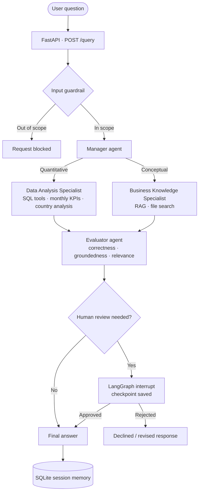

# Agentic Financial Analytics Assistant 

An agentic financial analytics application that combines SQL-based analytics, retrieval-augmented generation (RAG), tool calling, multi-agent orchestration, persistent session memory, guardrails, automated evaluation, and LangGraph-based human-in-the-loop workflows.

The application supports deterministic financial analysis, knowledge retrieval, agent routing, and approval-aware workflows that can pause for human review before recommended actions proceed.

This project uses privacy-safe simulated financial transaction data and contains no proprietary or employer data.

## What It Does

The assistant can:

- Analyze monthly transaction KPIs from a SQL-backed dataset
- Compare country-level transaction performance
- Retrieve financial definitions and analytical guidance from a vector-store knowledge base
- Route questions to specialized agents
- Coordinate multiple specialists through a manager-agent architecture
- Preserve conversation context with SQLite-backed sessions
- Use handoffs for specialist routing
- Block out-of-scope requests with input guardrails
- Evaluate responses for correctness, groundedness, and relevance
- Orchestrate stateful analytical workflows with LangGraph
- Determine when analytical recommendations require human review
- Pause execution for human approval or rejection and resume the workflow from the saved state

## Architecture



The project is organized around specialized components:

- **Data Analysis Specialist**  
  Uses SQL-backed tools for monthly KPIs and country-level transaction analysis.

- **Business Knowledge Specialist**  
  Uses RAG and hosted file search to retrieve financial definitions and supporting business knowledge.

- **Financial Analytics Manager**  
  Coordinates the data and knowledge specialists using Agents-as-Tools.

- **Triage / Handoff Agents**  
  Demonstrate decentralized routing between specialists.

- **Guarded Manager**  
  Applies an input guardrail to restrict the assistant to supported financial analytics topics.

- **Evaluator Agent**  
  Scores responses for correctness, groundedness, and relevance.

### LangGraph Human-in-the-Loop Workflow

A separate LangGraph workflow adds explicit stateful orchestration and human oversight for analytical recommendations.

The workflow:

1. Routes each question to the Data Analysis Specialist or Business Knowledge Specialist.
2. Executes the selected specialist and captures the analytical response in graph state.
3. Evaluates whether the response requires human review.
4. Completes directly when human approval is not required.
5. Uses a LangGraph interrupt when human review is required.
6. Waits for an explicit `approved` or `rejected` decision.
7. Resumes from the saved graph state and finalizes the response based on the human decision.

Workflow:

`User Question → LangGraph Router → Data Analysis / Business Knowledge → Approval Check → Human Review Required? → HITL Interrupt → Approve / Reject → Resume Graph → Finalize Decision`

This workflow uses LangGraph checkpointing to preserve execution state across the human-review interruption.

## Tech Stack

- Python
- SQL / SQLite
- OpenAI API
- OpenAI Agents SDK
- LangGraph
- Human-in-the-loop (HITL) Workflows
- Retrieval-Augmented Generation (RAG)
- Vector Search / File Search
- Function and Tool Calling
- Multi-Agent Orchestration
- SQLiteSession
- Pydantic
- Pandas
- FastAPI
- Pytest
- Docker
- GitHub Actions
- Google Cloud Platform (GCP)
- Artifact Registry
- Cloud Run
- Workload Identity Federation
- Google Secret Manager

## Project Structure

```text
agentic-financial-analytics-assistant/
├── .github/
│   └── workflows/
│       ├── ci.yml
│       └── cd.yml
├── data/
│   └── sample/
├── notebooks/
│   └── development.ipynb
├── scripts/
│   └── build_sample_database.py
├── src/
│   ├── agents/
│   │   ├── data_agent.py
│   │   ├── guarded_manager_agent.py
│   │   ├── handoff_agents.py
│   │   ├── knowledge_agent.py
│   │   ├── manager_agent.py
│   │   └── session.py
│   ├── evaluation/
│   │   └── evaluator.py
│   ├── guardrails/
│   │   └── input_guardrail.py
│   ├── langgraph_workflows/
│   │   ├── financial_assistant_graph.py
│   │   └── run_financial_graph.py
│   ├── rag/
│   │   └── knowledge_search.py
│   ├── tools/
│   │   └── analytics_tools.py
│   └── api.py
├── tests/
│   ├── test_api.py
│   ├── test_langgraph_workflow.py
│   └── test_smoke.py
├── .dockerignore
├── .env.example
├── .gitignore
├── Dockerfile
├── README.md
├── requirements.txt
└── requirements-dev.txt

## API & Deployment

The assistant is exposed through a FastAPI REST API and containerized with Docker for reproducible deployment.

### Run the LangGraph Human-in-the-Loop Workflow

Run the interactive LangGraph workflow:

```bash
python -m src.langgraph_workflows.run_financial_graph
```

Enter a financial analytics question when prompted.

For requests that do not require human review, the workflow completes normally. When a recommendation requires human oversight, the graph pauses execution and prompts for an explicit approval decision:

```text
--- HUMAN APPROVAL REQUIRED ---
Approve or reject?
```

Enter `approved` or `rejected` to resume the workflow. The final response reflects the human decision.

### API Endpoints

- `GET /health` - Health check for the service
- `POST /query` - Sends a financial analytics question to the guarded manager agent and returns the generated response

### Deployment Architecture

The application is deployed to Google Cloud using the following workflow:

1. FastAPI exposes the agentic analytics application as a REST API.
2. Docker packages the application and its dependencies into a portable container.
3. Google Artifact Registry stores versioned container images.
4. Google Cloud Run hosts the containerized API as a managed serverless service.
5. Google Secret Manager securely provides application secrets at runtime.
6. GitHub Actions runs CI tests and automates deployment from the `main` branch.
7. Workload Identity Federation allows GitHub Actions to authenticate to Google Cloud without storing long-lived GCP service-account keys.

### CI/CD

The repository contains separate GitHub Actions workflows for continuous integration and continuous deployment:

- **CI (`ci.yml`)** - Runs automated tests for repository changes.
- **CD (`cd.yml`)** - On pushes to `main`, authenticates to Google Cloud, builds the Docker image, pushes it to Artifact Registry, and deploys the new revision to Cloud Run.

This creates the deployment flow:

`GitHub → GitHub Actions → Docker Build → Artifact Registry → Cloud Run`

## Running Locally

### 1. Clone the repository

```bash
git clone https://github.com/VasavyaKandala99/agentic_financial_analytics_assistant.git
cd agentic_financial_analytics_assistant
```

### 2. Create and activate a virtual environment

```bash
python -m venv .venv
```

On Windows:

```bash
.venv\Scripts\activate
```

### 3. Install dependencies

```bash
pip install -r requirements.txt
```

### 4. Configure environment variables

Create a `.env` file based on `.env.example` and provide your own OpenAI credentials and vector store configuration.

Never commit API keys or other secrets to the repository.

### 5. Build the sample database

```bash
python scripts/build_sample_database.py
```

### 6. Start the FastAPI service

```bash
uvicorn src.api:app --host 0.0.0.0 --port 8000
```

The API will be available locally at:

`http://localhost:8000`

Interactive API documentation:

`http://localhost:8000/docs`

### Run with Docker

```bash
docker build -t agentic-financial-analytics-assistant .
docker run --env-file .env -p 8000:8000 agentic-financial-analytics-assistant
```

### Run Tests

```bash
python -m pytest -q
```

## Engineering Highlights

- Built a financial analytics assistant that combines deterministic SQL analytics with RAG-based business knowledge retrieval.
- Implemented specialized agents and manager-agent orchestration using the OpenAI Agents SDK.
- Added LangGraph-based stateful orchestration with explicit routing between data-analysis and business-knowledge specialists.
- Implemented a human-in-the-loop approval workflow using interrupts and checkpointing, allowing recommendation-driven workflows to pause for review and resume with an approved or rejected decision.
- Added function/tool calling, agent handoffs, persistent session context, input guardrails, tracing, and response evaluation.
- Exposed the agentic workflow through a FastAPI REST API with automated tests.
- Containerized the application with Docker for reproducible local and cloud execution.
- Deployed the containerized API to Google Cloud Run using Artifact Registry and Secret Manager.
- Implemented CI/CD with GitHub Actions, including automated testing, container builds, image publishing, and Cloud Run deployment.
- Configured Workload Identity Federation for keyless GitHub Actions authentication to Google Cloud.

